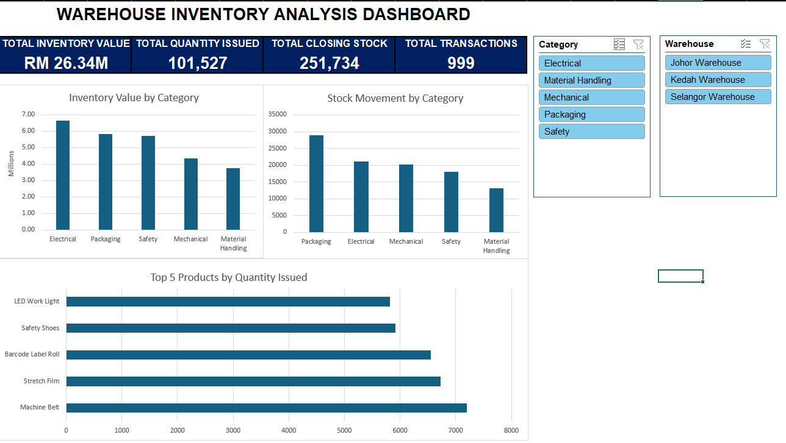

# Warehouse Inventory Analysis Dashboard

## Project Overview
This is a personal portfolio project using simulated warehouse inventory data.

The objective of this project is to analyze warehouse inventory performance, identify stock movement patterns, and present key inventory metrics through an interactive Microsoft Excel dashboard.

## Tools Used
- Microsoft Excel
- PivotTables
- PivotCharts
- Excel Tables
- Slicers
- Excel Formulas
- Data Cleaning

## Dataset
The dataset contains 999 warehouse transaction records after data cleaning.

Key fields include:
- Product
- Category
- Supplier
- Opening Stock
- Quantity Received
- Quantity Issued
- Closing Stock
- Unit Cost
- Inventory Value
- Warehouse

## Data Cleaning
The dataset was reviewed and cleaned before analysis.

Steps performed:
- Removed 1 duplicate record
- Corrected 3 missing supplier values
- Checked category consistency
- Checked warehouse values
- Validated the dataset before analysis

## Dashboard KPIs
The dashboard highlights four main KPIs:

- Total Inventory Value: RM26.34M
- Total Quantity Issued: 101,527
- Total Closing Stock: 251,734
- Total Transactions: 999

## Key Insights
- Electrical recorded the highest total inventory value.
- Packaging recorded the highest quantity issued, indicating the highest stock movement among the categories.
- Machine Belt recorded the highest quantity issued among individual products.

## Dashboard Preview

## Skills Demonstrated
- Data Cleaning
- Inventory Analysis
- PivotTable Analysis
- KPI Development
- Data Visualization
- Interactive Dashboard Design
- Warehouse Data Analysis

## Project Files
- `Warehouse_Inventory_Analysis_Dashboard.xlsx` - Complete Excel analysis and interactive dashboard
- `DASHBORD.png` - Dashboard preview

## Note
This project was created for portfolio purposes using simulated data and does not represent data from a real company.
